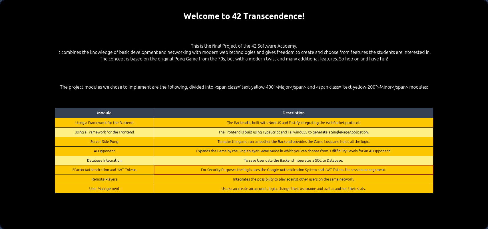

# Transcendence

  <!-- Replace with your screenshot path -->

## Overview
Transcendence is a full-stack web application inspired by the classic Pong game.  
The project focuses on building a real-time multiplayer experience with secure user authentication, game state management, and a modular web interface.  
It showcases front-end and back-end development skills, security practices, and integration of multiple technologies.

## Features
- Real-time multiplayer Pong game  
- Full-stack implementation: **Frontend:** TypeScript, HTML, CSS | **Backend:** Node.js, SQLite  
- Secure authentication with **JWT tokens** and optional **2FA**  
- User management and session handling  
- Protection against common web vulnerabilities (**XSS, CSRF**)  
- Modular UI allowing easy addition of new features or game modes  
- Integration with a real-time communication system (WebSockets)

## Approach
1. **Frontend:** Built with TypeScript and TailwindCSS, dynamic game rendering, interactive user interface.  
2. **Backend:** Node.js server handling authentication, game state, database interaction with SQLite.  
3. **Security:** JWT for session management, 2FA for sensitive actions, input sanitization for XSS prevention.  
4. **Game logic:** Real-time updates of player positions and scores using WebSockets.  
5. **Modular architecture:** Each module (game, statistics, user management) is separated for easy maintainability and extensibility.

## Usage
Compile / install dependencies / run containers:
```bash
make build
```


Open your browser and navigate to:
```
https://localhost
```

---

## Technologies
- **Frontend:** TypeScript, HTML, CSS  
- **Backend:** Node.js, Express, SQLite, WebSockets  
- **Security:** JWT, 2FA, input sanitization  
- **Development tools:** Git, Docker

---

## Authors
Timo Eichelmann
[Dustin Wilke](https://github.com/LoneOne123)
[Subin Park](https://github.com/subinprk)
[Taka Nakajo](https://github.com/tnakajo42)
[Carlos Denegri](https://github.com/cadenegr)

